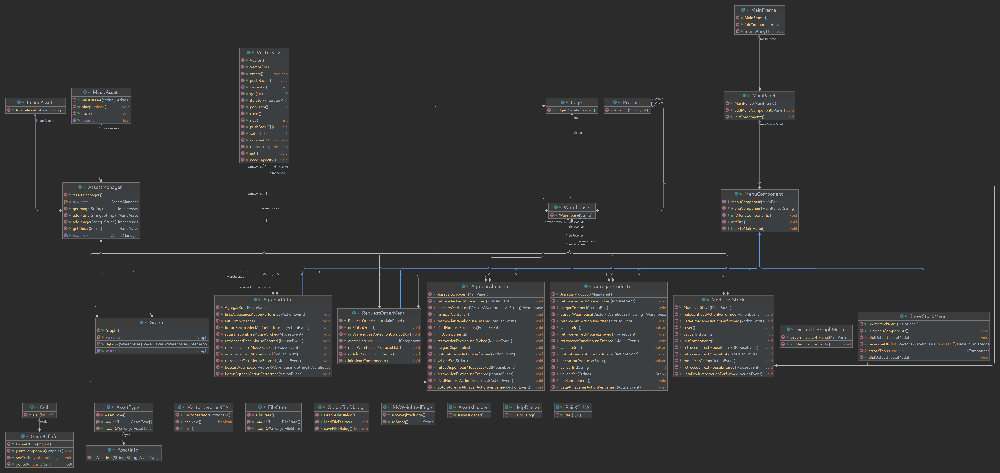

# Proyecto1-EstruturasDeDatos

### Proyecto 1 de la materia estructuras de datos

# Manejador de proyecto: [Maven](https://github.com/Stolkerve/Proyecto1-EstruturasDeDatos/tree/main) y [Ant](https://github.com/Stolkerve/Proyecto1-EstruturasDeDatos/tree/ant)

# Version de Java: 11

# Diagrama UML

# Equipo:
- [Sebastian Gonzalez](https://github.com/Stolkerve)
- [Andres Bucarello](https://github.com/andresbucarello)
- [Asdrubal Rivas](https://github.com/Retr0os)  